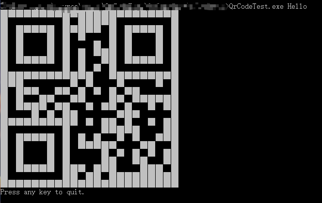

## CSharp QrCodeTest

#### 功能概述

通过在命令行输入参数，生成QrCode。

#### 项目特色

1.在命令行输入参数（长度不要超过100个字符）为所需生成QrCode时，会在控制台屏幕上输出对应黑、白字符方块组成的QrCode码，如下图所示：

2.在命令行里传递一个文本文件名，读取文件中每一行的字符串信息，在控制台界面输入如下命令，可以将file.txt中的每一行信息生成一个QrCode。

-f表示QrCode信息放在-f后的data\qrcode.txt文件中。生成的QrCode保存的文件名为信息所在行号三位数+信息的前四个字符的png格式。

#### 代码总量

100+行

#### 工作时间

约两天

#### 结论

基本完成了实验要求，通过此次实验，基本了解了Qrcode的生成方式，简单掌握了C#控制台编程。

